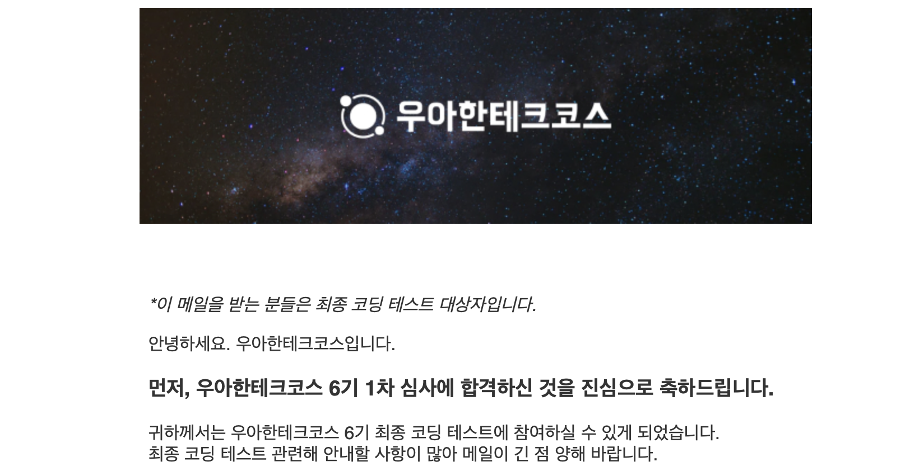

# woowa-precourse
우아한 테크코스 6기 프리코스 과정

| 과제 | 내용 | 코드 리뷰 |
| :--- | :--- | :---: |
| ⚾ 숫자 야구 | 숫자 야구 게임 프로그램 | [#1338](https://github.com/woowacourse-precourse/java-baseball-6/pull/1338) |
| 🏎️ 자동차 경주 | 자동차 경주 게임 프로그램 | [#253](https://github.com/woowacourse-precourse/java-racingcar-6/pull/253) |
| 💰 로또 | 로또를 생성 및 구매한 후, 수익률을 계산하는 프로그램 | [#1067](https://github.com/woowacourse-precourse/java-lotto-6/pull/1067) |
| 🎄 크리스마스 프로모션 | 주문한 메뉴에 대해 크리스마스 프로모션 혜택 내역을 출력하는 프로그램 | [#1](https://github.com/youngsu5582/java-christmas-6-youngsu5582/pull/1) |    

# 1차 결과

